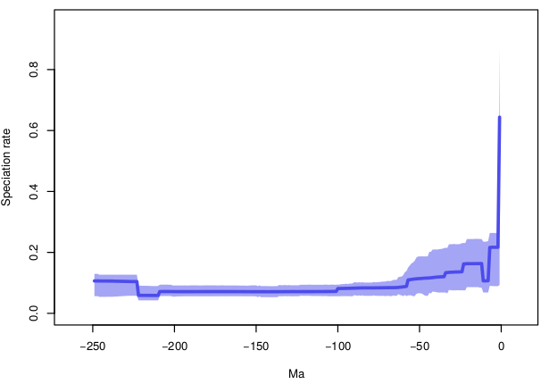

```{r, echo=F}
setwd("/home/eeb177-student/Desktop/eeb-177/final-project")

```

## Introduction 

The general population has many misconceptions in their understanding of dinosaurs, and more specifically the dinosauria clade. The purpose of this study and report is to create a better general understanding of the dinosauria clade. The exact evolutionary orgin and timing of the clade is unkown but believed to be between 231 and 243 million years ago (Alcober). During the Early Jurassic period (about 200 million years ago) dinosaurs were diversifying rapidly. From the Late Jurassic (about 145 million years ago) uptill the Late Cretaceous (about 65 million years ago) is considered the peak time for dinosaurs(Nesbitt). This study will be using shell scripting,  python, and Rstudio to create a  better understand of dinosaurs by analyzing the fossil occurrences of the dinosauria clade that can be found on the Paleobiology Database at https://paleobiodb.org/#/ while also attempting to answer one specific question. Dinosauria is a well-supported clade and can be identified by many different features such as "loss of the postfrontal on the skull and an elongate deltopectoral crest on the humerus" meaning that reserchers can be fairly confident in their identification of whether the fossil found falls into the dinosauria clade or not(Weishampel). 

One specific question that researchers are trying to answer is whether dinosaurs are cold-blooded (ectotherms), warm-blooded (endotherms), or intermediate-blooded (mesotherms). This same question is also the focus in this study. There has been much debate over the question and one interesting way that this study tries to test if dinosaurs are ectotherms, endotherms, or mesotherms is by looking at the distribution of the species across the world map. The hypothesis in this paper is that if dinosaurs were ectotherms one would expect them to be located more towards the equator/ near the warmer regions to be able to survive better. 

The Paleobiology Database allows a person to enter a clade of interest and then returns the fossil occurrences of that clade with a large amount of information attached to each fossil record occurrence. For example, besides just the ID number for the fossil occurrence, one can also receive the longitude and latitude of where the fossil was found, the range of time in millions of years ago sa to when the species would have existed, the fossil's possible taxonomic rank, and more. For a clade as large as dinosauria, one of the challenges is being able to extract the relevant fields and manage such a large volume of data. 

## Methods and Results 

#### Cleaning the data
As mentioned in the introduction, in this study there is a large volume of data that is generated and it is important to be able to filter out the needed fields. One easy way to clean the data and filter out the needed fields is by using the shell. The command used in this study is 
```{bash, eval=F}
tail n+17 dinosaurs-data.csv | cut -d "," f 3-10, 15, 16,17 > edited-dino-data.csv
```
The tail command allows a person to skip the header that comes with the data when a person uses the The Paleobiology Database. Although the header gives useful information such as when the data was downloaded, from where, and so on, it creates difficulties down the road when trying to analyze the data. The cut -d command specifies that the csv file should be cut along the commas to create different fields and the -f lets you specify which columns you want to keep. Lastly, the “>” character creates a new csv with just the columns you cut. 
\newpage

#### Mapping Dinosaur Fossil Occurrence
As mentioned previosly, in this study the hypothesis that dinosaurs were ectotherms and so one would expect them to be located more towards the equator/ near the warmer regions will be tested. This is done by first extracting the longitudes and latitudes from the overall data set. The longitudes and latitudes can then be plugged into R and displayed as points on the world map. Below is the code and final results of graphing the longitudes and latitudes. 

##### Function Separate Longitude and Latitude in Python
```{python, eval=F}
def long_lat(filename):
  in_file = open(filename)
  #output = open("output_lat_long.csv", "w")
  output_lat= open("output_lat.csv", "w")
  output_long = open("output_long.csv", "w")
  
  lat = []
  long = []
  
  for line in in_file:
      temp_lats = line.split('","')[17]
      temp_longs = line.split('","')[16]
      outline1 = "{}\n".format(temp_lats)
      outline2 = "{}\n".format(temp_longs)
  
      #lat.append(float(temp_lats))
      #long.append(float(temp_lons))
      output_lat.write(outline1)
      output_long.write(outline2)
  output_lat.close()
  output_long.close()
```
##### Code to Create Graph in R
```{r, eval = F}
library(ggplot2)
library(maps)

world_map <- map_data("world")

plot <- ggplot() + coord_fixed() +
  xlab("") + ylab("")


actual_world <- plot + geom_polygon(data=world_map, aes(x=long, y=lat, group=group), 
colour="black", fill="white")

actual_world
#reading in my longitude data and latitude data
dino <- read.csv("/home/eeb177-student/Desktop/eeb-177/final-project/long-lat/output_lat_
long.csv", header = T, as.is = T)
names(dino)<- c("lat", "long")

map_data <- actual_world + geom_point(data=dino,aes(x=long, y=lat), colour="Blue",pch=2, 
size=0.1, alpha=I(1)) + labs(title = "Fossil Records on World Map", x = "Longitude", y = 
"Latitude") + theme(plot.title = element_text(hjust = 0.5, size=18, face = "bold"), 
axis.title =element_text(size=10))

map_data
```


#### Further Exploration 
Since part of the goal of this paper was also to help the general population understand more about the dinosauria clade and it is important to understand the data a person is  working with, another form of analysis that was done was graphing out the specicies diversity during different time periods. The function for parsing the needed data and the code to create the graph is seen below and was done in python. 

```{python, eval=F}
def dino_time_period_graph(filename):
    dino_data= open(filename, "r", encoding = "ISO-8859-1")
    alldata=dino_data.readlines() [18:] 
    Timeperiod_dict = {} 
    for line in alldata:
        record_elements = line.split(",") 
        Timeperiod = record_elements[12] 
        if Timeperiod in Timeperiod_dict: 
            count = Timeperiod_dict[Timeperiod] 
            Timeperiod_dict[Timeperiod] = count + 1 
        else: 
            Timeperiod_dict[Timeperiod] = 1  
    return Timeperiod_dict
    
print(dino_time_period_graph("Dinosauria.csv"))


import matplotlib.pyplot as plot
plot.figure(figsize=(50,17))
plot.bar(range(len(dino_time_period_graph("Dinosauria.csv"))), 
dino_time_period_graph("Dinosauria.csv").values(), align='center')
plot.xticks(range(len(dino_time_period_graph("Dinosauria.csv"))), 
list(dino_time_period_graph("Dinosauria.csv").keys()), rotation = 'vertical')
plot.margins(0.001)
plot.subplots_adjust(bottom=0.1)
plot.title('Species Diversity During Each Time Period', fontsize = 45)
plot.xlabel('Time Period', fontsize = 35)
plot.ylabel('Number of Species', fontsize = 35)

plot.show()
```


Another way to gain a better understanding of the species present in the clade is by visualizing the species and the estimated length of their survival. This can done through the R code below. 
```{r, eval=FALSE}
library(ggplot2)
dino <- read.csv("/home/eeb177-student/Desktop/eeb-177/final-project/cleaned-dino.csv", 
header = F, as.is = T)
names(dino) <- c("genus", "species", "minage", "maxage")
head(dino)

dino_occ <- ggplot(dino, aes( x = species, maxage, colour = genus))

dino_occ + geom_linerange(aes(ymin = minage, ymax = maxage)) + 
theme(legend.position="none") +  coord_flip() +  theme(axis.text.y = 
element_text(size=3)) + scale_y_continuous(limits=c(0, 250), expand = c(0, 0), 
breaks=c(0,50,100,150,200,250)) + labs(title = "Dino Fossil Occurrences", x = "Species", 
y = "Ma ago") + theme(plot.title = element_text(hjust = 0.5, size=22, face = "bold"), 
axis.title =element_text(size=20)) 

library(forcats)
dino_occ <- ggplot(dino, aes( x = species, maxage, colour = genus))

dino_occ <- ggplot(dino, aes( x = fct_reorder(species, minage, .desc = T), maxage, colour
= genus))

dino_occ + geom_linerange(aes(ymin = minage, ymax = maxage + 1.5)) + 
theme(legend.position="none") +  coord_flip() +  theme(axis.text.y = 
element_text(size=5)) + scale_y_continuous(limits=c(0, 250), expand = c(0, 0), 
breaks=c(0,50,100,150,200,250)) + labs(title = "Dino Fossil Occurrences", x = "Species", 
y = "Ma ago") + theme(plot.title = element_text(hjust = 0.5, size=22, face = "bold"), 
axis.title =element_text(size=20))


library(tidyr)
library(dplyr)

diversity <- dino %>% gather(key = type, value = age, minage, maxage) %>% mutate(count = 
ifelse(type == "maxage", 1, -1)) %>% group_by(age) %>% summarise(count = sum(count))  %>%
arrange(-age, -count) %>% mutate(diversity = cumsum(count)) 

ggplot(diversity, aes(x = age, y = diversity)) + geom_step()

diversity <- dino %>% gather(key = type, value = age, minage, maxage)

head(diversity)

diversity <- diversity %>% mutate(count = ifelse(type == "maxage", 1, -1))

head(diversity)

diversity <- diversity %>% group_by(age) 
head(diversity)

diversity <- diversity %>% summarise(count = sum(count)) 
head(diversity)

diversity <- diversity %>% arrange(-age, -count) 
head(diversity)

diversity <- diversity %>% mutate(diversity = cumsum(count)) 
head(diversity)

ggplot(diversity, aes(x = age, y = diversity)) + geom_step()
```


\newpage

Lastly, a couple more interesting factors to look at to better understand the clade would be the speciation rate, extinction rate, and net diversification rate. These graphs can be seen below and are created by running the data through a program called PyRate.




## Discussion

Now it is time to go back to the beginning and determine if the original hypothesis should be accepted to rejected. If you look at the world map and the distribution of the dinosaurs, one thing that was not taken into account is that the temperature 100 million year ago was a lot warmer meaning that the dinosaurs could be a lot more spread out even if they were ectotherms. Furthermore, the longitudes and latitudes provided by the database are where the fossils were found. This means the longitudes and latitudes do not account for the fact that hundreds of millions of years ago the continents had not yet completely separated and that the geography was different. However, it is interesting to see that you do not see any dinosaurs near the very top or bottom of the map where the temperature would be cold. Overall the data and evidence is inconclusive and more analysis would have to be done to truly determine if dinosaurs were ectotherms. Looking at the other graphs provides further insight into the dinosauria clade. For example, looking at the diversity vs time graph on page 7 shows that there was a sharp drop in the diversity for the clade at about 60 million years ago. This lines up with what is generally accepted as the time for extinction of dinosaurs. 

One of the problems faced in this study was the large amount of data and the fact that the dinosauria clade has so many unique species. One way to solve this problem and a possible future study would be to group the fossil occurences by a higher taxonomic rank such as family or order. By grouping by a higher taxonmic rank and then graphing diversity one might be able to observe a trend or see if one family survived longer than another family. It would prove to be an interesting study to then determine what traits made certain families in the clade better adpted for survival. More future work that also needs to be done is cleaning the graphs to be able to better display the results. 

\newpage
## References

http://www.ucmp.berkeley.edu/diapsids/dinofr.html

Alcober, Oscar A., and Ricardo N. Martinez. “A New Herrerasaurid (Dinosauria, Saurischia) from the Upper Triassic Ischigualasto Formation of Northwestern Argentina.” ZooKeys 63 (2010): 55–81. PMC. Web. 3 Mar. 2017. https://www.ncbi.nlm.nih.gov/pmc/articles/PMC3088398/

Nesbitt, Sterling J. et al. “The Oldest Dinosaur? A Middle Triassic Dinosauriform from Tanzania.” Biology Letters 9.1 (2013): 20120949. PMC. Web. 3 Mar. 2017. https://www.ncbi.nlm.nih.gov/pmc/articles/PMC3565515/

Weishampel, Dodson & Osmolska, 2004, The Dinosauria


## Github Link
https://github.com/adikantawala/eeb-177-final-project
